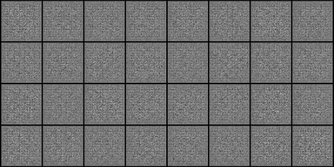
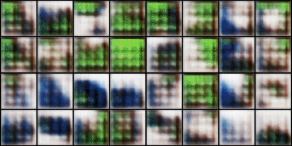

# Deep Convolutional GAN (DCGAN)

[[source paper]](https://arxiv.org/abs/1511.06434)

## Abstract

In recent years, supervised learning with convolutional networks (CNNs) has seen huge adoption in computer vision applications. Comparatively, unsupervised learning with CNNs has received less attention. In this work we hope to help bridge the gap between the success of CNNs for supervised learning and unsupervised learning. We introduce a class of CNNs called deep convolutional generative adversarial networks (DCGANs), that have certain architectural constraints, and demonstrate that they are a strong candidate for unsupervised learning. Training on various image datasets, we show convincing evidence that our deep convolutional adversarial pair learns a hierarchy of representations from object parts to scenes in both the generator and discriminator. Additionally, we use the learned features for novel tasks - demonstrating their applicability as general image representations.

# Run training

```
$ cd 2_DCGAN
$ python training.py
```

## Result

I trained in two basic dataset are NMIST and CIFAR-10, the result bellow here

<p align="center">
    
</p>

<p align="center">
    
</p>
